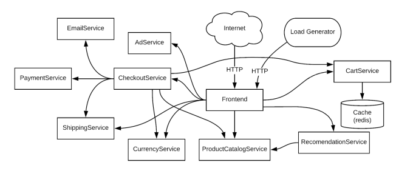
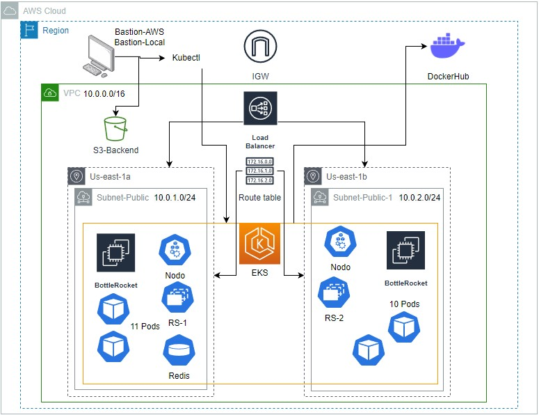

# Obligatorio - 2023 - Infraestructura en Soluciones Cloud
# Docente Mauricio Amendola
### Alumnos
* Federico Gonzalez - 245993
* Heber Dario Meneses - 257370

## Presentacion del obligatorio
Una empresa busca migrar su infraestructura on-premise al cloud, se entrega un diagramas de como es la estructura previa para verificar las necesidades.  

# Resumen de la solución
La solución propuesta se basa en el uso de servicios de la nube y se apoya en los principios de Infraestructura como Código (IaC). Se emplean diversas herramientas con el fin de lograr un despliegue rápido y eficiente del sitio web, migrando así los servicios previamente propuestos.

En primera instancia, se hace uso de dos módulos personalizados para crear una estructura básica que albergará los servicios necesarios. Estos recursos incluyen una VPC (Virtual Private Cloud), subredes, tabla de enrutamiento y un internet gateway. Estos componentes son fundamentales para establecer una infraestructura sólida.

Posteriormente, se procede al despliegue de los servicios previamente mencionados. Para ello, se prepara un entorno local o una máquina virtual en AWS. En este entorno se instalan los servicios necesarios para llevar a cabo las acciones requeridas. Se crea un clúster de Kubernetes, el cual se configura con restricciones de comunicación entre los componentes internos del clúster y la comunicación externa.

Este enfoque permite automatizar el despliegue de la infraestructura y facilita la gestión y escalabilidad de los servicios en la nube. Al utilizar IaC, se logra una mayor eficiencia y agilidad en la implementación y administración de la infraestructura, lo que resulta beneficioso para el despliegue exitoso del sitio web.
## Diagrama de AWS
***

## Estructura de directorios
***
[Estructura-Backend](files/backend.md)  
[Main-Principal](files/main.md)  
[Modulo-Infra](files/infra.md)  
[Modulo-Red](files/red.md)

## Prerequisitos
***
Es necesario tener una cuenta en DockerHub.

## Como ejecutar la solucion
***

1. Descargar el repositorio en algun sistema (Ubuntu en este caso)
2. Ejecutar los scripts de aprovisionamiento de script_1 al script_3
3. Ejecute (. script_1.sh) el primer Script instala todo lo necesario para que funcione el Ubuntu
4. Ejecute (. script_2.sh) el segundo Script le consulta por sus credenciales de AWS
5. Ejecute (. script_3.sh) el tercer Script le ayuda con el build, tag y push de las imagenes a docker hub
6. Ejecutar el backend antes del main (Modificar al momento de llamar al recurso backend sin tener el bucket y dynamodb previamente creado.)
7. Ejecutar en el directorio raiz OBL-ISC, terraform init
8. Ejecutar terraform apply -var-file=terraform.tfvars
9. Ejecutar el cuarto y final Script le ayuda a establecer comunicacion con Kubect1 y ver el sitio web a los 2 minutos proporcionandole el enlace

## Demostracion de funcionamiento
***
[Demostracion](https://www.youtube.com/watch?v=IhmfQYJdJBE)  
[Presentacion](https://fi365-my.sharepoint.com/:p:/g/personal/hm257370_fi365_ort_edu_uy/EWbkKtbj-O5MihIILExPc4IBuPoejrjusEU3kiHcT8u8rw?e=12LV67)  

## Anexo
***
[revision](files/limitaciones.md)  